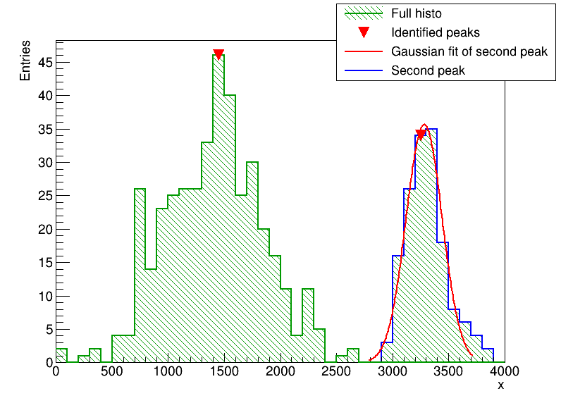
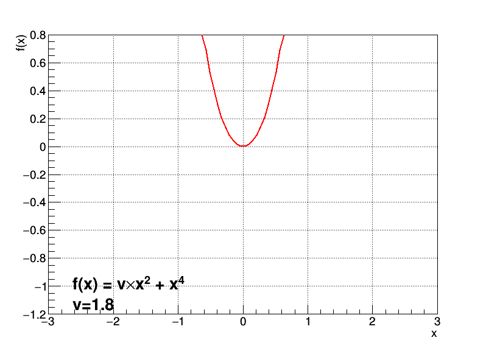

# ROOTmacro

Some ROOT macro in C++ or Python. 

Note that the macros presented here are tested for **`root-6.04.02`**. 

## Package organisation 

Each folder contains: 

- `macro.*`  : the actual code
- `data.*`   : data (optional)
- `result.*` : the output (optional)

## PeakFinderHistogram (Python)

Use of a `TSpectrum` to find a second peak in a `TH1F` and remove that part from the initial histogram. 

## CreateGIF : example fo the "Mexican hat" function (C++)

Create an animated `.gif` showing the Higgs boson potential (`v*x**2 + x**4`) evolution as `v` becomes negative. 

