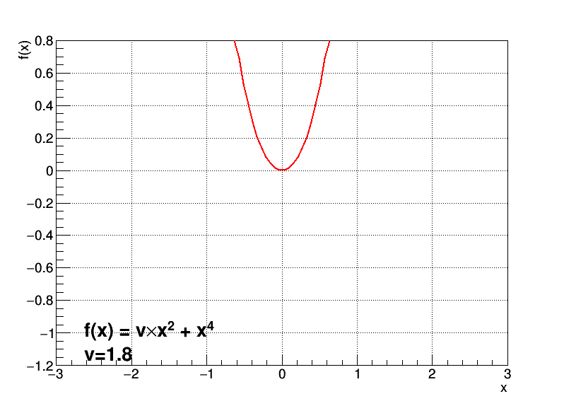

# ROOTmacro

Some ROOT macro in C++ or Python. 

## Package organisation 

Each folder contains: 

- macro.* : the actual code
- data.* : data (optional)
- result.* : the output (optional)

## Peak finder in histogram (Python)

Use of a `TSpectrum` to find the peaks and remove that part from the initial histogram. 

## Higgs boson potential (Mexican hat) (C++)

Create an animated gif showing the Higgs boson potential (v.x2 + x4) evolution as v becomes negative. 

